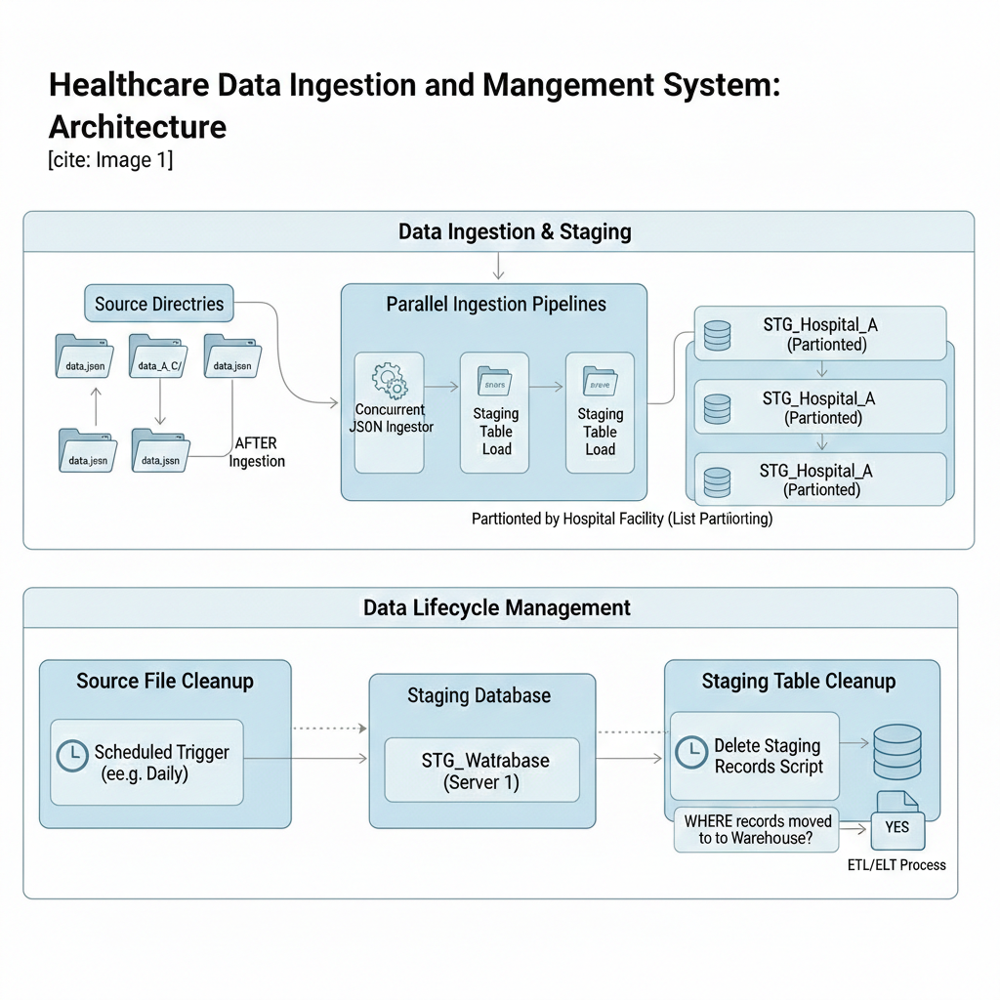

# File Ingestion Process



## Overview
The core objective of this system is to bridge the gap between raw edge-node data (JSON) and a structured Data Warehouse, while strictly managing the physical and logical storage footprint.

#### Key Components
- Parallel Ingestion Engine: Utilizes concurrent workers to monitor and ingest JSON files from facility-specific directories into the database.
- Partitioned Staging Layer: Data is loaded into staging tables partitioned by Facility_ID (List Partitioning) to facilitate rapid downstream processing and easy management.
- Source Cleanup Pipeline: A post-ingestion trigger that identifies successfully processed files and removes them from the local file system to prevent disk saturation.
- Staging Purge Pipeline: A synchronization-aware cleanup process that deletes records from the staging environment only after verification of a successful migration to the remote Data Warehouse.

## Table of Contents
- [Introduction](#introduction)
- [Prerequisites](#prerequisites)
- [Installation](#installation)
- [Configuration](#configuration)
- [Usage](#usage)
- [Deployment](#deployment)
- [License](#license)
- [Contributing](#contributing)  
- [Authors & Acknoledgements](#authors_and_acknowledgments)

## Introduction <a name="introduction"></a>
In modern healthcare informatics, the ability to process high volumes of facility-specific data with low latency is critical. This project implements a high-performance Concurrent Data Ingestion Pipeline designed to ingest JSON-based clinical records from multiple source directories into a centralized staging environment. 
The system is engineered to handle data from various hospital facilities simultaneously, utilizing List Partitioning to ensure data isolation, security, and query optimization. Beyond ingestion, the framework incorporates automated Data Lifecycle Management (DLM) pipelines to maintain storage hygiene by purging processed files and archived staging records, ensuring the system remains performant and cost-effective.

## Installation <a name="installation"></a>

#### Prerequisites <a name="prerequisites"></a>
Before running the File Ingestion Process, ensure you have the following prerequisites installed:
- Database: A SQL instance supporting partitioning (e.g., PostgreSQL 14+).
- Environment: Python 3.9+ with pip installed.
- Storage: Read/Write permissions on all source JSON directories.

## Configuration <a name="configuration"></a>
Create database_credentials file and fill in the info
```
nano /home/server_user/lamisplus_ingestion/.env
# Database connection settings
DB_USER=database_username
DB_PASSWORD=database_password
DB_PORT=6432

# Database names used by your python scripts
DB_NAME_FILEDB=filedb
DB_NAME_LAMISPLUS_STAGING_DWH=lamisplus_staging_dwh
```

## Usage <a name="usage"></a>
Navigate to server_user folder and create virtual environment
```
cd /home/server_user
```

Clone the repository to your local machine:
``` 
git clone https://github.com/Arshavin023/parallel_data_ingestion.git
```

Navigate to the ingestion pipeline directory:
``` 
docker compose down
docker network prune -f
docker compose build --no-cache
docker compose run --rm file-ingestion-service
docker compose run --rm dsd-ingestion-service
docker compose run --rm records-deletion-service
docker compose run --rm file-deletion-service
```

Schedule Pipeline
```
crontab -e 
# 1. Run Standard File Ingestion every 30 minutes
*/30 * * * * cd /home/server_user/lamisplus_ingestion && /usr/local/bin/docker-compose run --rm file-ingestion-service

# 2. Run DSD Ingestion every hour (at minute 15 to offset the database load)
15 * * * * cd /home/server_user/lamisplus_ingestion && /usr/local/bin/docker-compose run --rm dsd-ingestion-service

# 3. Run Records Deletion every day at midnight
0 0 * * * cd /home/server_user/lamisplus_ingestion && /usr/local/bin/docker-compose run --rm records-deletion-service

# 4. Run File Deletion every Sunday at 2:00 AM
0 2 * * 0 cd /home/server_user/lamisplus_ingestion && /usr/local/bin/docker-compose run --rm file-deletion-service
```

## License <a name="license"></a>
- MIT License

## Authors & Acknowledgements <a name="authors_and_acknowledgments"></a>
- [Uche Nnodim](https://github.com/Arshavin023)
- [Emmanuel Nnajiofor](https://github.com/emmannajichi)
- [ChukwuEmeka Ilozie](https://github.com/Asquarep)
- [Peter Abiodun](https://github.com/drjavanew)
- [Barnabas Tyav](https://github.com/tyavbarnabas)


# trigger
